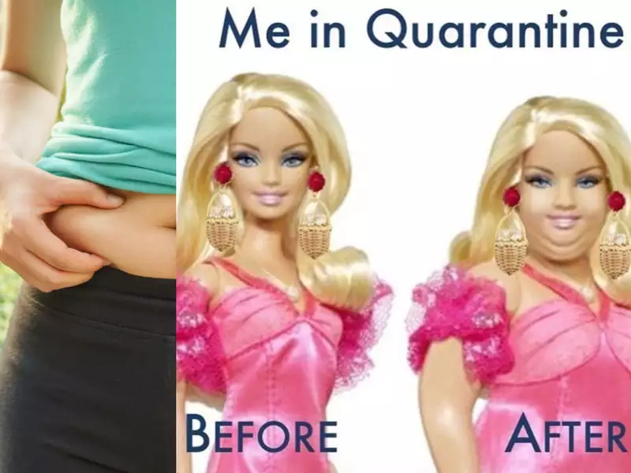
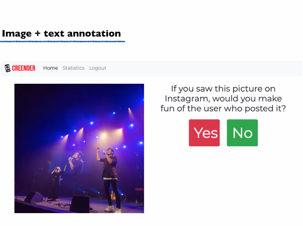

# Linguistica-Webinar-170620

# Come si legge un’immagine? Esercizi di annotazione interattiva

## La nostra Classroom
Questo webinar fa parte di una programmazione più ampia, dedicata all’interazione tra linguistica e didattica in classe, e pensata per condividere e sviluppare attività, idee, suggerimenti, e per instaurare uno scambio di esperienze e necessità. Per questo abbiamo creato una piattaforma di discussione online: puoi accedere alla stanza dedicata di <a href="https://classroom.google.com/u/0/" target="_blank">Google Classroom</a>, utilizzando il codice **jdibcze**.
Speriamo che questa diventi un punto di incontro tra tutte le competenze fin qui coinvolte, per poterci scambiare opinioni sulle attività e proposte inedite per temi, metodi e strumenti di lavoro a scuola. 

## Le nostre proposte: attività di annotazione con template G-Docs

Le attività che vi proponiamo in questo webinar si collegano al nostro percorso di comprensione del testo dedicato all’identificazione ed emersione delle categorie e delle funzioni che caratterizzano il linguaggio ostile, o **hate speech**: il **metodo** dell’annotazione - e della successiva emersione di fenomeni linguistici e *sociali*- permette di operare un’analisi critica sull’immagine, allo scopo di generare una maggiore consapevolezza nell’uso degli strumenti e delle diverse modalità comunicative (non solo il testo quindi, ma anche le immagini) a nostra disposizione. 
Vi abbiamo preparato un <a href="https://docs.google.com/document/d/1PCVFKw4e0LTb41KfydVf74ajRHSyD7YgspjlNUh-rY8/edit#heading=h.woep0u49atx2" target="_blank">template</a> da utilizzare per l’attività: ricordate di farne prima una copia nella vostra cartella di lavoro! L’attività di annotazione si basa sull’uso della griglia per l’analisi multimodale che vi avevamo presentato negli scorsi webinar; come per tutti i nostri materiali, i template rappresentano dei modelli che potrete poi adattare in base alle vostre esigenze didattiche e al tipo di immagini che volete (far) analizzare. Oggi analizzeremo alcune immagini campione prese dal web, disponibili accedendo a <a href="https://drive.google.com/drive/u/0/folders/1lfGUhrX80JIlP53gQ3B-LBQ6MkZ5V7-V" target="_blank">questa cartella</a>. Seguendo la griglia di annotazione data, scopo dell’attività sarà quello di individuare gli elementi (o la combinazione di elementi) all’interno dell’immagine capaci di veicolare messaggi potenzialmente offensivi, in base alle seguenti categorie di **hate speech**:
* Razzismo
* Discriminazione religiosa
* Abilismo
* Omofobia
* Sessismo
* Body shaming 

Vi proponiamo alcune domande e spunti di riflessione, partendo da questo *meme* circolato online e sui social durante il periodo del lockdown: 

* Se ritieni che l’immagine contenga un messaggio offensivo, credi che questo sia veicolato da un elemento (**figura**) in particolare all’interno dell’immagine o piuttosto da una combinazione di elementi diversi (**opera**)?
* Prova a riflettere sulle **relazioni intervisuali**: che cosa ti suggerisce la didascalia *before - after*? Sicuramente ti sarà capitato di vedere immagini con una simile dicitura: cosa contenevano? In che modo sono generalmente connotate le immagini riferite al *before*? E quelle riferite all’*after*? 

## Le nostre proposte: attività di annotazione con Creender

Creender è un software open source creato da Alessio Palmero Aprosio (**Fondazione Bruno Kessler**) nell’ambito del progetto **CREEP** (Cyberbulling Effects Prevention) coordinato dalla prof.ssa Sara Tonelli, con lo scopo di identificare e prevenire gli effetti del cyberbullismo sugli adolescenti. Creender nasce quindi come tool di annotazione di contenuti multimodali (in particolare immagini tratte dai social media) per l’analisi dei fenomeni legati alla violenza verbale, ed è stato utilizzato - in via sperimentale - in alcune classi pilota di scuole secondarie di primo e secondo grado della provincia di Trento. 

### Come funziona Creender?

